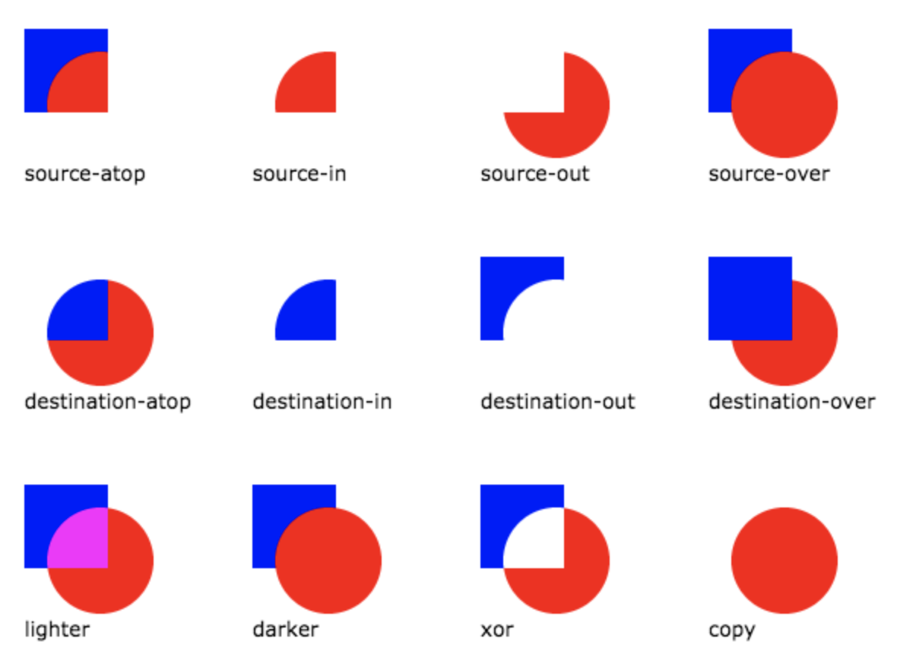

# canvas-toolset

## What is Canvas?

The HTML tag ```<canvas>``` - supported in all modern browsers - is an element to draw graphics (graphs, animations, etc.) with a JavaScript context object which creates graphics on the fly ; it uses Canvas API.

Canvas only supports one primitive shape: rectangles. To create other shapes, simple or complexe, we need to combine paths, lists of points connected by lines and use functions.

Animations are only the result of drawing and redrawing shapes. The performance depends on the speed of the computer it's running on.

## Tips

- If a rendering seems distorted when setting its size via CSS, you need to specify a width and a height directly in the ```<canvas>``` HTML tag.
- To animate a shape, you need before every move to save the canvas original state, clear the canvas and restore the canvas original state.
- How to position elements with operations:




## Documentation

https://developer.mozilla.org/en-US/docs/Web/API/Canvas_API/Tutorial 
